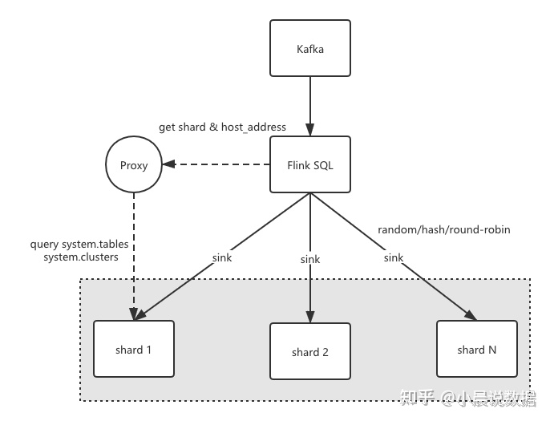
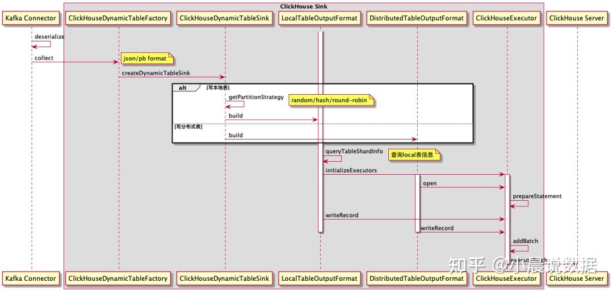

# flink-connectors

##  flink-connector-clickhouse
```sql

CREATE TABLE sink_table (
    name VARCHAR,
    grade BIGINT,
    rate FLOAT,
    more FLOAT,
    PRIMARY KEY (name, grade) NOT ENFORCED /* 如果指定 pk，进入 update 模式 */
) WITH (
    'connector' = 'clickhouse',
    'url' = 'clickhouse://<host>:<port>',
    'username' = '<username>',
    'password' = '<password>',
    'database-name' = 'default',        -- ClickHouse 数据库名，默认为 default 
    'table-name' = '',                  -- ClickHouse 数据表名
    'table.collapsing.field' = 'Sign',  -- CollapsingMergeTree 类型列字段的名称
    'sink.batch-size' = '100000',       -- batch 大小
    'sink.flush-interval' = '30000',    -- flush 时间间隔
    'sink.max-retries' = '3',           -- 最大重试次数
    'sink.partition-strategy' = 'hash', --hash | random | balanced
    'sink.write-local' = 'true',        -- 开启本地表写入
    'sink.write-local-nodes' = 'xxx:8123,xxx:8123,...', -- 分片节点
    'sink.partition-key' = 'name,grade' --hash 策略下的分区键
);
```


### Flink写入本地表

Flink写入分布式表能完成功能逻辑，但在性能和可靠性上还是略微有差异：

- 由于数据是由ClickHouse节点做二次分发，会占用写入分布式表节点比较多的内存；

- 集群节点异常后，导致分布式表无法准确把数据分发到新节点。

基于以上问题，我们在Flink的ClickHouse Connector端做了相应改造，支持写入本地表的相关功能。主要流程如下：


- 根据库名和表名查system.tables获取表的engine信息(SELECT engine_full FROM system.tables WHERE database = ? AND name = ? )

- 解析engine信息，获取集群名、本地表名；

- 根据集群名，查system.clusters获取集群分片节点信息 (SELECT shard_num, host_address FROM system.clusters WHERE cluster = ?)，得到TreeMap<shard_num, shard host list>这样的配置信息

- 根据shard配置信息，初始化List<ClickHouseShardExecutor>, ClickHouseShardExecutor 内部初始化时会随机shard group里的url来连接；负责将flink内部的数据结构RowData 添加到batch buffer里，并根据sink.buffer-flush.max-rows buffer大小和sink.buffer-flush.interval flush间隔来触发flush，将一批数据真正的sink 到 ClickHouse Server端。

- 当shard内，个别节点负载比较高或查询有热点时，会导致batch flush失败，这个时候需要做异常时重连操作。


究竟某条数据过来sink 到哪个shard，我们定义了RowData 到ClickHouseShardExecutor 的分区接口，并实现了3种分区策略round-robin轮询 、random随机分区、field-hash基于字段的一致性哈希等策略，通过 sink.partition-key 参数指定分区字段，保证相同分区字段哈希到同shard内。整体架构如下图所示：


Flink数据写入的时序图可以参考如下所示:

````

_参考_：*ClickHouse 在唯品会 OLAP 系统的实践* https://zhuanlan.zhihu.com/p/387910160
